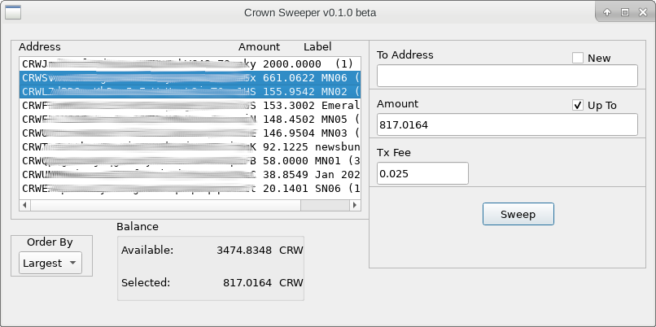

Crown Sweeper v0.1.0 beta
=========================

This tool is designed to facilitate sweeping masternode and systemnode rewards. It
can also be used any time you want to exercise control over which "coins" are used 
in a particular send operation. 

## Background
Over time node rewards, especially for operators of multiple nodes, can accumulate 
in numbers so large that even using coin control in the GUI wallet it is not trivial
to consolidate them. The sweeper can be run when using either daemon or GUI wallet
and provides hybrid functionality between coin control and the "spendfrom" command
line tool.

## Operation
Upon execution a window is displayed showing all the wallet addresses containing
unlocked Unspent Transaction Outputs ( 
[UTXOs](https://en.wikipedia.org/wiki/Unspent_transaction_output) 
), the total amount of CRW in each address, the label/account attached
to each address and the number of UTXOs in each. 

One or more addresses may be 
selected by clicking on them. The sum available in those addresses is displayed and 
entered by default in the "Amount" box. The amount can be overridden if the user
chooses. The "To" address can be entered manually, a new address in the same 
wallet generated automatically, or one of the from addresses can be copied as the
destination. 

The "Upto" checkbox serves two functions:
* It indicates that fees are included in the sent amount (ie: the received amount
will be smaller than shown by at least the fees amount)
* It indicates that a transaction should be generated even if the total value of
the available UTXOs which will fit within the transaction size limit is less than
the required amount.

If "Upto" is not checked then the fee is additional to the amount to send, and 
the value in the selected addresses must be greater than the sum of amount and 
fee. Any change will be sent to the first used from address.  

The fee defaults to 0.025 CRW. You may choose a smaller or larger (upto 1% of the 
transaction value) amount.

After selecting the inputs and setting the receiving address, amount and fee,
hit "Sweep" and the transaction will be generated. If successfully broadcast the 
transaction id will be displayed and the UTXO list refreshed. If the generate/broadcast fails the reason why will be shown instead.

Transactions are limited in size to 250KB (about 1600 UTXOs) and in value up to the
available funds. You may need to perform more than one sweep if the amount to send 
cannot be accommodated in a single transaction.

## Acknowledgements
Crown Sweeper is a python wrapper around the command line "spendfrom" tool found
in the Bitcoin/contrib directory. 

The Crown Sweeper icon is based on a broom icon in the "Stay at home" pack by 
Freepik at [Flaticon.com](https://www.flaticon.com/free-icon/sweeping_2728954?term=broom&page=1&position=6)

# Licence
Crown Sweeper is released under the MIT License.

## MIT License

Copyright (c) 2020 The Crown Developers

Permission is hereby granted, free of charge, to any person obtaining a copy
of this software and associated documentation files (the "Software"), to deal
in the Software without restriction, including without limitation the rights
to use, copy, modify, merge, publish, distribute, sublicense, and/or sell
copies of the Software, and to permit persons to whom the Software is
furnished to do so, subject to the following conditions:

The above copyright notice and this permission notice shall be included in all
copies or substantial portions of the Software.

THE SOFTWARE IS PROVIDED "AS IS", WITHOUT WARRANTY OF ANY KIND, EXPRESS OR
IMPLIED, INCLUDING BUT NOT LIMITED TO THE WARRANTIES OF MERCHANTABILITY,
FITNESS FOR A PARTICULAR PURPOSE AND NONINFRINGEMENT. IN NO EVENT SHALL THE
AUTHORS OR COPYRIGHT HOLDERS BE LIABLE FOR ANY CLAIM, DAMAGES OR OTHER
LIABILITY, WHETHER IN AN ACTION OF CONTRACT, TORT OR OTHERWISE, ARISING FROM,
OUT OF OR IN CONNECTION WITH THE SOFTWARE OR THE USE OR OTHER DEALINGS IN THE
SOFTWARE.

